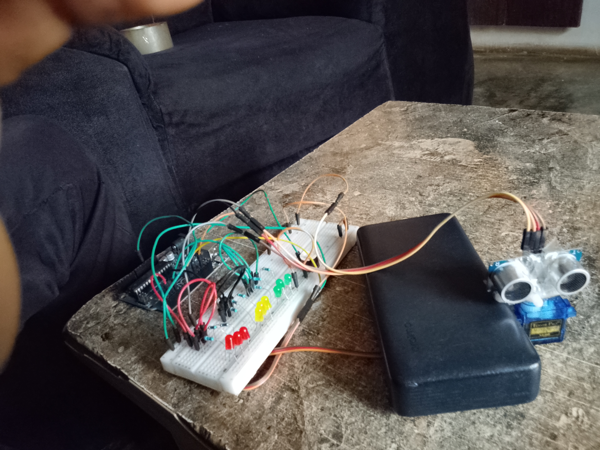
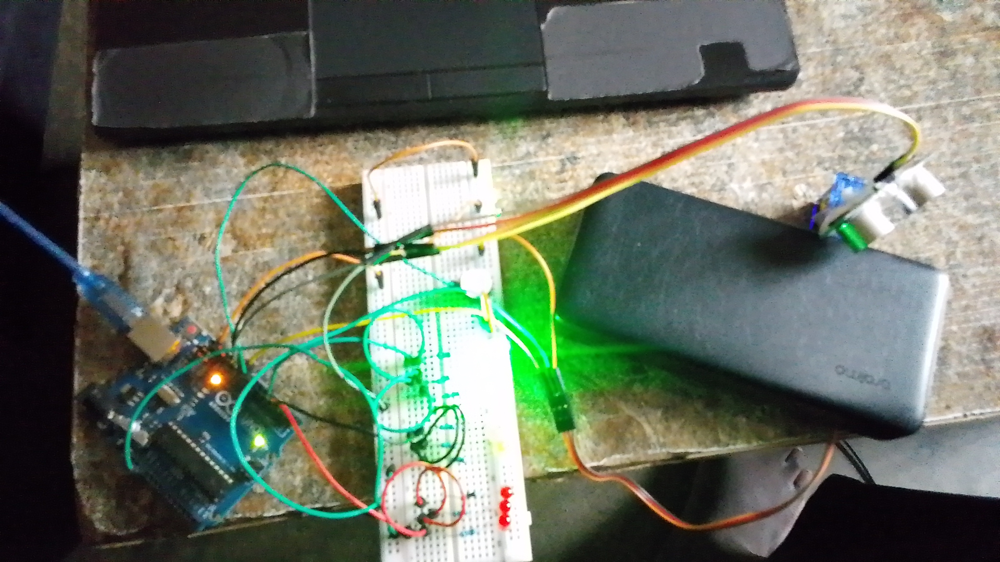

# AI Adaptive Obstacle Detection System

## Overview
This project is an embedded system built using Arduino that simulates AI-like adaptive behavior for obstacle detection. It uses an ultrasonic sensor to measure distance and dynamically controls LEDs, a buzzer, and a servo motor based on real-time environmental conditions.

The system classifies distance into different zones and responds accordingly with visual, audio, and mechanical actions.

---

## Project Images

### System Setup

### Output Behavior (LED Indication)

---

## Video Demonstration
🎥 Watch the full project demonstration here:  
https://youtube.com/your-video-link

The video shows the system in real-time operation, including:
- Distance detection using ultrasonic sensor  
- Servo motor scanning movement  
- LED zone indication (Safe / Warning / Danger)  
- Buzzer alert responses based on proximity  

---

## Components Used
- Arduino board
- Ultrasonic sensor (HC-SR04)
- Servo motor
- Green, Yellow, and Red LEDs
- Buzzer
- Resistors, jumper wires, breadboard

---

## System Logic

The system continuously measures distance and classifies it into three zones:

### 🟢 SAFE ZONE (distance ≥ 50)
- Green LED blinks
- Buzzer OFF
- Servo scans environment
- Serial output: "SAFE ZONE"

---

### 🟡 WARNING ZONE (25 ≤ distance < 50)
- Yellow LED blinks
- Buzzer ON (steady alert)
- Servo scans at moderate pace
- Serial output: "WARNING ZONE"

---

### 🔴 DANGER ZONE (distance < 25)
- Red LED flashes rapidly
- Buzzer alarm pattern
- Servo scans aggressively
- Serial output: "DANGER ZONE"

---

## How the Code Works

### Distance Measurement
The ultrasonic sensor calculates distance using echo pulse timing and converts it into centimeters.

---

### Servo Scanning
The servo motor executes:
- 0° → 90° → 180° → 90°
This improves environmental coverage based on threat level.

---

### LED and Buzzer Control
Each zone triggers different responses:
- Green → Safe indication
- Yellow → Warning alert
- Red → Emergency alarm

---

## Demostration video
[Click this link for the video demo](https://www.youtube.com/playlist?list=PL4jjdUPfbiheLFbLEfzcVd4n5HsUE3YKg)

## Code Features
- Real-time sensor processing
- Multi-zone classification system
- Servo-based scanning behavior
- Adaptive LED and buzzer responses
- Serial monitoring output

---

## Project Concept
This system simulates **AI-inspired embedded behavior**, where the device:
- Observes sensor input
- Interprets distance data
- Classifies threat levels
- Responds dynamically using hardware components
- Continuously adapts based on environmental changes

